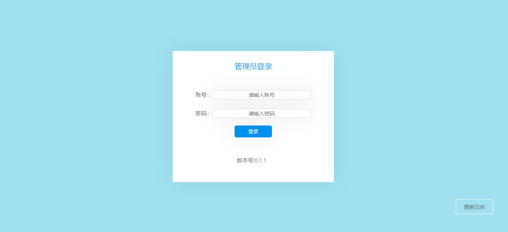
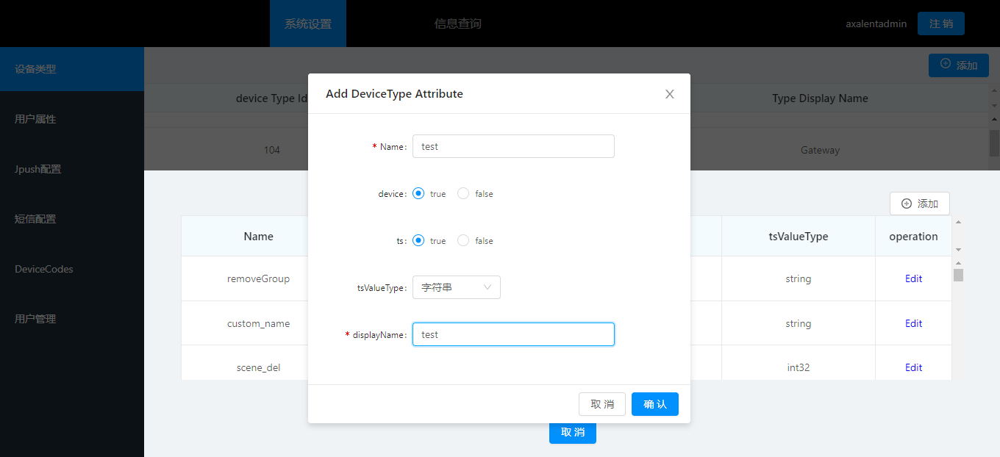
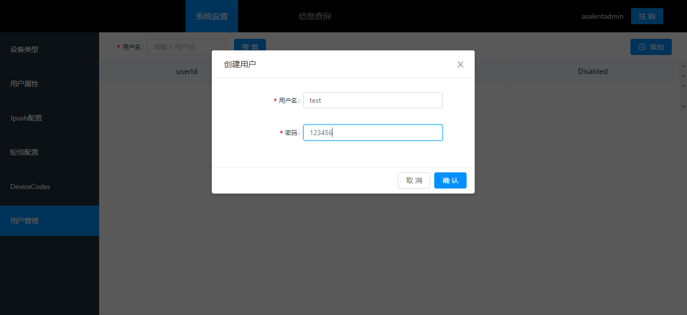
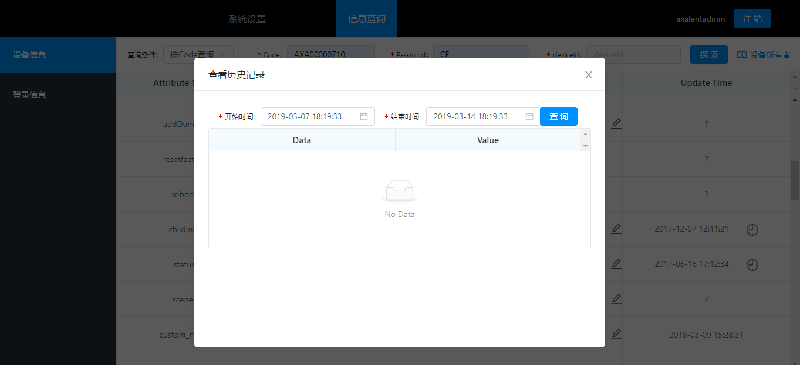

# ConfiguratorManual

## 一、Login

Enter the right administrator account and password, then click the “Login” to enter the homepage.

## 二、System configuration

### 1. Device Type

In the navigation bar on the left, the information of all device types will be shown(Device type number, name, display name) when the device type has been chosen

#### 1.1 How to add device type

Click the “Add” in the top right corner, then the system will pop up a popup layer with a form. Enter the Type name and display name in the layer, then click the “Confirm” to add a new device type. 

#### 1.2 How to check the attribute of device type

Click on a row in the table, then you can check the attribute of device type

#### 1.3 How to add attribute

In the floating window of the view device type, click the “ADD” in the top right corner, then a pop-up layer with a form will be shown. Enter the Name(Attribute name) and device(Whether it is a hardware attribute or not. The hardware attribute needs be send to the hardware and save in the cloud, otherwise, it only needs save in the cloud. 0= save in the cloud only, 1=need send to the hardware and save in the cloud.), ts(Whether it has history record or not), tsValueType( Value type), displayName( Display name). click “confirm” to add the attribute. 

### 2. User Attribute

Click the user attribute in the left navigation bar to check all user attribute under the current administrator account.

#### 2.1 How to add the user attribute.

Click the “Add” in the top right corner, then the system will pop up a popup layer with a form. Enter the Attribute name and Display name, then click “Confirm” to add the user attribute.

### 3.  Jpush Configuration

Click the Jpush configuration in the left navigation bar，enter the appKey，masterSec in the right, then click “ Confirm” to finish the configuration. 

### 4. SMS Configuration

Click the SMS configuration in the left navigation bar， enter accessKey, accessSecret, signName, registerationTemplate. recoverTemplate, then click “ Confirm” to finish the configuration. 

### 5. DeviceCodes

<strong>How to add the device code</strong>

Click the “Device Codes” in the top right corner, then click the “Add” , the system will pop up a popup layer with a form. Enter Code. Password, Aes Key（32-bit hexadecimal string）, then click “Confirm” to add a device code.

### 6. User Management

Click the “User Management” in the left navigation bar to enter this module

#### 6.1 How to add a new account

Click the “Add” in the top right corner, then the system will pop up a popup layer with a form. Enter the account and password, then click “Confirm” to add a new account under the current administrator.

#### 6.2  How to search an account

Enter the account that you want to search in the top left, then click “Search” to seach the information about the account.( Disabled means the current account is now disabled, 0 =yes 1=no)

 
## 二、C.Information inquiry

Click the ” Information Inquiry” tab at the top to enter the page.

### 1.  Device Infomation

When the device information on the left side is activated, the device information can be queried on the right side of the page, and related operations are performed.

#### 1.1 How to check the device information

The device information can be checked by different condition in the form. If you follow the code query, you need enter the code (Gateway name), password (Gateway password), then click search, the information will show on the form. If you follow the deviceid query, then just enter the device id.

#### 1.2  How to modify the device attribute

The device attribute can be modified after been searched. Click the “ Active Value” on the tab, enter the information you want to modify, or you can modify the device attribute by clicking the single box. 

#### 1.3 How to check the device history record

There is a pop up layer when the clock icon in the “Update Time” tab been clicked, chose the start time and end time then you can check the information of  device history record. 

### 2. Login Information

Click the option of login information on the left to enter the module.

#### 	2.1 How to check the user information

Enter the account in the tab of user information, click “Search” to check the last 5 login information.

