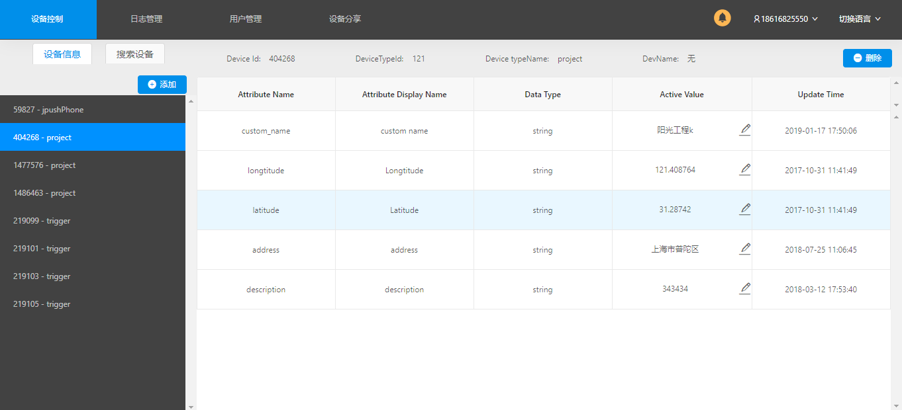
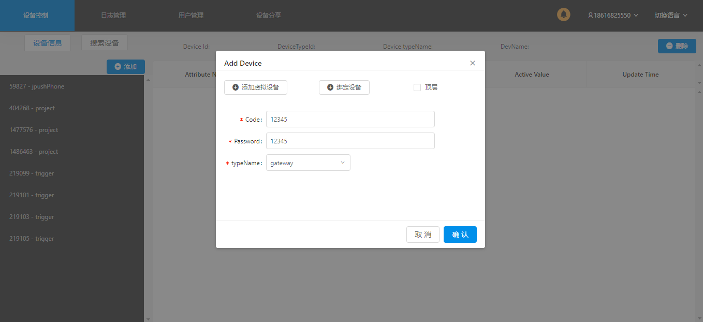

# 	Utility Management Tools User Manual

## 一、 Login

Enter the correct account, password and App ID to login the homepage.

## 二、Device Control

### 1. Device Information

#### 1.1 Check The Device Attribute 

Click the list on the left side to check the related device attribute and device information.

#### 1.2 How to modify the device attribute

Click the pencil icon in “Active Value” on the right, then enter the content you want to modify. Click “√” to confirm and “×” to cancel 

#### 1.3 How to check the historical record of the device
If there is a clock icon in the “Update Time” tab on the right side, the record can be checked, otherwise the record can’t be found. 
Click the clock icon, select the start time and end time in the dialog, then click “Search” to check the record of the related period. 

### 2.How to add the device

<strong>How to add the virtual device</strong>

Select the device on the left then click “Add”, chose the “ Add virtual device” then select the device type in the dropdown list. Click “ Confirm” to add the device under the selected device, if there is no selected device, the new device will be added in the outermost. 

<strong>How to bind the device</strong>

Select the device on the left side, click “Add” and “Bind the device”, select the device type in the dropdown list then click “Confirm” to add the device under the selected device. If there is no selected device, the new device will be added in the outermost. 

### 3. How to delete the device

Select the “Device Delete” on the left side, then click the “Delete” to finish the operation.(The device under the gateway cannot be deleted by this way) 

### 4. How to search the device

Click the “Device Search” to enter the page, enter the device you want to search then click the search icon to finish the operation. Click the result of the search, the related information: Device attribute, Setting attribute and record will be shown. 
Click the “Online device display” dialog to check all online device. 

##  三、Log management

To enter the log management, click the “Log Management” tab

### 1. Check the device historical record.

Select the start time and end time(Start time cannot be greater than the end time), then click “Search” to check the related record and time can be reset by clicking the “Reset” button. 

### 2.Detail

#### 2.1 Device Detail

To check the device attribute, click “Detail”

#### 2.2 Check the related record of device attribute.

Click the clock icon, to check the related record of device attribute. 

