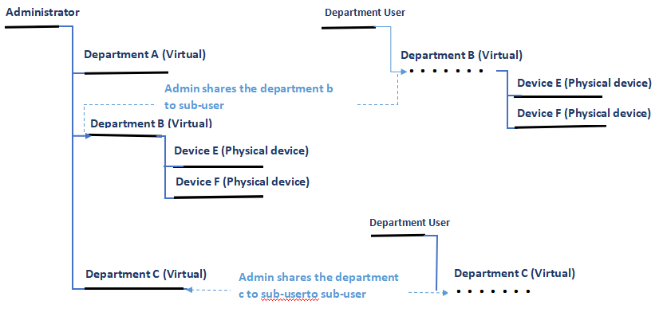

# xCloud Function Overview

## 1.  Overview

###  1) Device side
<strong>Device-side design：</strong>Physical equipment (air conditioner, washing machine, etc.). Virtual device (region, scene, group, etc.). Service device (Message flow control device, Schedule service device, Message notification service device)

<strong>Device Access：</strong>Provide a stable and efficient service of device access to access the physical equipment, for example air conditioner, washing machine, etc.

<strong>Device association interaction：</strong>The message interaction between device and device. The interaction between device and service device (Schedule service device and notification service device). The interaction between service device and service device (Schedule service device, notification service device, message flow device).

###  2)User management side

<strong>Multiple App support：</strong>Support for unrelated products and project App, every App has its own resource space on the cloud and a unique App ID. Every App has its independent administrator account, responsible for managing and maintaining the relevant configuration of the application including: Notification configuration, device type configuration, SMS configuration, etc.

<strong>Hierarchical user system： </strong>Administrator can manage the project, create and maintain the product. The normal user can bind and use the product, also can create and disable the sub-user. 

<strong>Ordinary user registration method：</strong>
The administrator creates the normal user: Account and password are required. 
Register by phones: Normal user can register by SMS verification code. 

<strong>Sharing ystem：</strong>
Owner:  Device owner, has all permissions to the device。

<strong>Sharing：</strong>Device Owner can share the device to other user, and can set the permission of the device to others (Total control; reading and writing; only reading; only writing) 

###  3)Manage tool side

<strong>System control console：</strong>Background operation and maintenance related work
<strong>Application management console：</strong>Project maintenance and management
<strong>Developer console：</strong>  Project development and adjustment.
<strong>Data analysis console：</strong> Project data monitoring in the late stage.

##  2.  The platform face to the device

Device is consist of a unique device type and a group of device attribute. Device attribute means the status of the device. To change the device status, you need change the device attribute. 

<strong>Physical device：</strong> Air condition, washing machine, etc. A unique device code is built in each physical device at production time.

<strong>Virtual device：</strong>Exist in App of area, architecture, scenes, group, etc. but has no physical device to link the background 

<strong>Service：</strong>Service device is a special virtual device, including the message flow service device, schedule service device, notification service device, and etc. All these devices are connected with the background. Service device is the virtual device built in the cloud platform. 

<strong>Custom device type：</strong>Developer can create a custom device by the management tool, and define the related attributes.

<strong>Device attribute flow：</strong> Device attribute flow will be produced when the device status changes. The platform provides this service to redirect the attribute flow for device interaction. The interaction can be done between devices and devices, devices and services, and services and services. More dynamic rules of service flow management will be provided. 

###   2.1  Service Device

2.1.1Message flow management service device - trigger

#### 2.1.1  Message flow management service device - trigger

|Attribute Name|Description|
|----|----|
srcId|The device ID of source device and devices under this account have the reading or higher permission.|
srcAttribute|The device attribute name of source device|
value|The device attribute value of source device|
operator|Analyzing conditions： values in total(1:<，2：≤，3：＝，4：≥ ，5：>，6：The same string，7：Regular Expression)|
targetId|The device ID of target device, devices under this account have the writing or higher permission.|
targetTypeId|The device type ID of target device|
targetAttribute|The attribute name of target device|
targetValue|The attribute value of target device|
enabled|Enable or disable the trigger|

<strong>Create：</strong> The createVirtualDevice interface to create the trigger type device. The createVirtualDevice interface to create the trigger type device. 

<strong>Modify： </strong>The setDeviceAttribute interface to modify the rules of trigger.

<strong>Delete： </strong>The removeDeviceFromUser interface to delete the rules of trigger. 
Description： Device attribute flow management. Monitoring all specified message flow under the account and produce the message flow to another specified device. 

<strong>Application scenario 1： </strong> 
When someone passing the aisle, the lights turns on: 
When the motion of body induction A is Ture, we set the attribute level of light B to 100.

There are 3 devices example in this application scenario:

<strong>Body Induction ：</strong>

|Attribute|Value|
|----|----|
ID|12345|
typeID|10001|
Name|Body Induction Sensor|
Motion|false|

<strong>Light：</strong>

|Attribute|Value|
|----|----|
ID|12346|
typeID|10002|
Name|Aisle Light|
Level|0|
Power|Off|

<strong>Trigger：</strong>

|Attribute|Value|
|----|----|
srcId|12345（Body induction ID）
srcAttribute|Motion (Body induction monitoring attribute)|
value|True    (Monitored people)|
operator|== (Source attribute equals, triggered when monitored people)|
targetId|12346(Light device)|
targetTypeId|Type ID of light device|
targetAttribute|Level(Type ID of light device)|
targetValue|80  (Lights up)|
enabled|True  (Working)

<strong>Application scenario 2：</strong>

When people leave the room, click the “Leaving Scenario” by phone, then all the device will be turned off. 
When the attribute of “Leaving Scenario” activates True, the attribute level of light A will be set to 0. The attribute power of TV B will be set to False and same to attribute power of air-condition C.When people leave the room, click the “Leaving Scenario” by phone, then all the device will be turned off. 
When the attribute of “Leaving Scenario” activates True, the attribute level of light A will be set to 0. The attribute power of TV B will be set to False and same to attribute power of air-condition C.

###  2.1.2	Schedule ervice device - schedule

 
|Attribute Name|Description|
|----|----|
activate|When the scheduled time is up, this attribute will be set to 1|
cycle|Set the timing loop. Never means no loop, when the first schedule completes, the attribute of enable will be set to 0  Day，Week，Month，Year|
datetime|Scheduled time,GMT|
userData|Save the user data|
custom_name|Save the schedule name|
enable|Enable or disable the schedule|

Create, modify, delete can refer the trigger device part

Description: Create the schedule device, the activate attribute is triggered to be True for the specified time and period.

Example： When the staff are having lunch break in the office, dimmer the lights and reduce the air condition.

###	2.1.3 JPush Notification - JPushNotification

|Attribute Name|Description|
|----|----|
phoneId|The unique code of phone|
platform|IOS or Android|
alias|Push the alias name|
msg|Push the message|
apns_production|IOS push the logo of server|

Create, modify, delete can refer the trigger device part
Description: For message notification on the phone.Create, modify, delete can refer the trigger device part
Description: For message notification on the phone.Create, modify, delete can refer the trigger device part
Description: For message notification on the phone.

###	2.1.4  WeChat Notification - WXPushNotification

|Attribute Name|Description|
|----|----|
touser|The unique logo of WeChat user|
template|Notification template of WeChat|
form_id|WeChat Notification Authorization mark|
keywords|The message pushed by WeChat|
send|Send message|

Create, modify, delete can refer the trigger device part
Description: Used for WeChat applet template message push

<strong>More complicated linkage：</strong>

<strong>Scene 1：</strong> When the phone has been monitored that it has returned home, the security system will be set to the “Home Mode” .

<strong>Scene 2：</strong> Bring the security system online automatically on weekends 

These complex App all can be done with the combination of devices, schedules, and triggers.

##	3.  User system

User registration method:
1. The administrator “createUser” create the normal user, and mutual friend status.

2. User registration can be done by SMS verification code.

### 3.1 Sharing system

Normal user and normal user can be added to each other as a contact, same as the sub-user. 

1）The contact can share the device with each other. 
2）The device owner has the permission to share the device to others.
3）The contact of the shared device can have the 4 forms of permission: Total control, reading and writing, only reading and only writing

Application Scenario: The parents have their separate account for each. If the father has the permission of the device in the lobby, then he can share this permission with mother

Various permission descriptions:

Total control:
1）Control and check the device status. 
2）Add or deleted sub-devices under the device. 
3）Sharing again.
Reading and writing： 
1) Control and check the device status.

Only reading：
1) Check the device status.

Only writing:
1)Control the device status.

###  3.2  Hierarchical user system

Normal user can create the sub-user. 

1) Sub-user can be created by method of account and password. It is a special user, has partial permission of normal user: Add device, delete device, and contact management. 
2) Parent-user and sub-user are contact with each other and can sharing the device one to another. 
3) Sub-user cannot create the sub-user under his account.
4) Parent-user can modify the password of its sub-user and enable or disable the account.
5) Except the description above, the sub-user can add or delete the device purchased by himself as the normal one.

<strong>Application scenario 1：</strong>Father has his own account and he can create a sub-account to the children. For example: He shares the permission of lobby to his children, then the children  install a smart light in the room, now he shares this permission of the light to his father. 

<strong>Application scenario 2：</strong>In the system of lighting, the admin has his own account and create sub-account to the company for various departments. The admin is responsible for the device installation and configuration of whole building and sharing the permission to all departments. 

## 4.  Tree architecture device system

Tree architecture device system: Virtual device can create a new virtual device or physical device. Corresponding to the actual application, there are scene, for example building, floor, room scene requirements.
createVirtualDevice: To create a virtual sub-device, first, create a virtual device then assign the parent device at same time. 

<strong>Application scenario：</strong>In the lighting system of building, there is a hierarchical architecture of: Project; Area; Room; Gateway; Light.

The type of virtual device above: Project, area, room and etc. are determined by project needs. Developer creates the device types and defines the attribute list of these by configuration management tool. Then create the virtual device example (Project, area, room) by ”createVirtualDevice”. When the sub-device example is being created, the “Assign parentId system” will automatically put the sub-device example to the assigned parent-device example. 

<strong>Gateway device system</strong>

Gateway device can create and maintain the sub-devices and sub-device has its own device ID and device type, but only uses the channel of gateway device to communicate with the server. In the device list, it is the next sub-device of the gateway device. For details, please refer to “Gateway device access manual”

<strong>Application scenario：</strong>It is necessary to be compatible with lights, human sensor, smart switch and etc. under the Bluetooth Mesh gateway. 

The limitation of this application scenario:

1）The number of each type of sub-device is uncertain.
2）The device ID of sub-device is determined by Bluetooth Mesh network, the server side cannot know the device ID beforehand.

When the definition of the product has been determined, the device type and the attribute list of gateway, light, motion, plug can be created and defined.

<strong>Embedded side：</strong>

Gateway login the server through code, password and AES Key built in the device SDK. To get a session when the gateway matches the new sub-device, using the AxLogin port to introduce the ID of local Bluetooth network and device type(Light, motion sensor or plug), then communicate the server with the session. Use Axlogout to logout the sub-device, and use AxDelete to delete a device. 

<strong>APP side：</strong>Through the “getDeviceList” to get the device list of the tree architecture list. Sub-devices created by Gateway are mounted under the gateway device. Operating the sub-device by App side has no difference with other devices, except that the sub-devices are added and deleted by gateways. 

##  5. API/SDK support

<strong>Embedded side：</strong>

1）Double chip solution: Using the Wi-Fi module with protocol integration. The existing Wi-Fi module that has integrated the XCA protocol including MXCHIP, High Flying, QCA4004 and ESP Mesh and etc. The customer applicate the main-MCU communicates with the Wi-Fi module through the serial port protocol. 
2）Single chip solution: Integrate the XCA SDK into the main chip. The requirement of platform: RAM 10k, TCP/UDP support.
3）Gateway solution, integrate the XGM SDK to communicate with the server. The requirement of the operation: Linux.
4）Multi-protocol extension (Afoot)： Provide server-side Adaptor to be compatible with other protocol access device.

<strong>APP side：</strong>

1）Public version My Home APP, the embedded device that follow the definition of the device type by the platform and can use and control with the My Home APP.
2）Web service API is used to develop APP side application. 
3）Android/iOS/React Native/JS SDK, Web Service API package, provide the friendly programming interface to speed up the APP development.
4）Provide the Demo APP Code (Android/iOS) of the device type generating and assigning automatically by the console. User can modify and replace the UI of the product on the basis of it (Afoot). 

##  6. Data Analysis 

Provide the console tool of data analysis, for analyzing the data of the project and the product during the operation and maintenance. Currently, the console is built-in: 
User analysis: User amount; User daily activity; User landing location distribution
Device analysis: Device amount; Device daily activity and etc.
Custom analysis: In the console, you can customize the Python script,data acquisition based on the Python SDK, data analysis and report display. 

