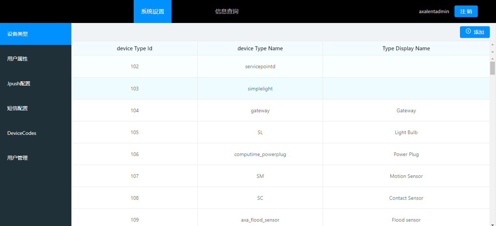
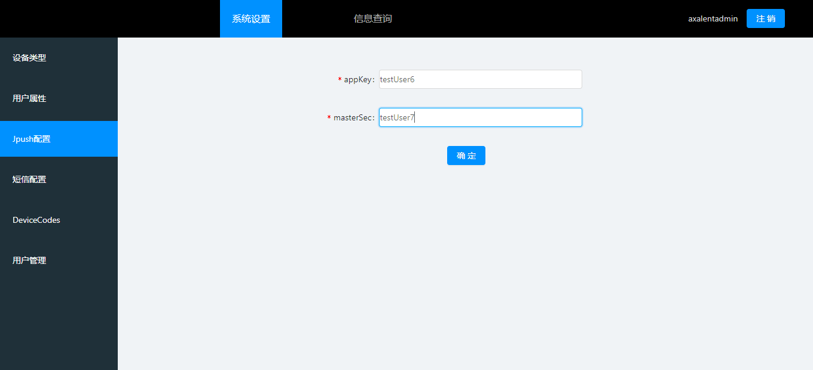
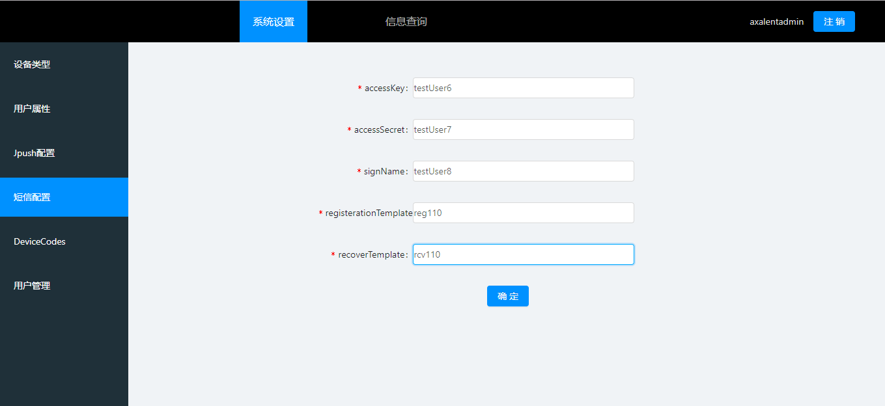
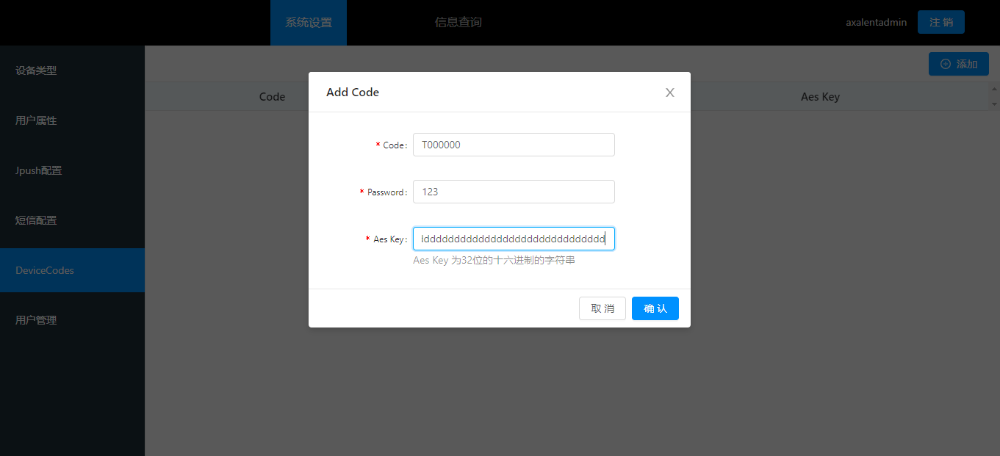
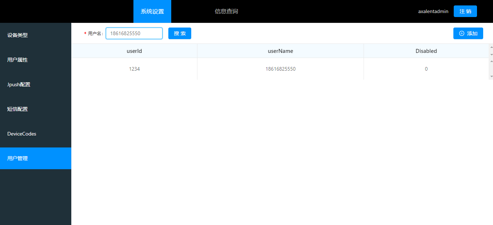
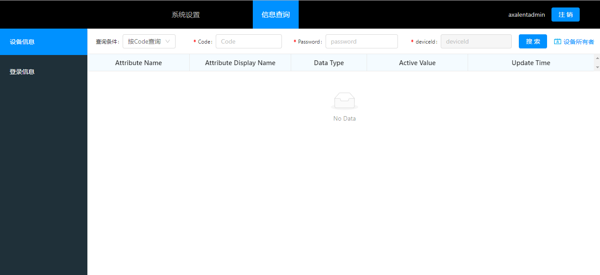
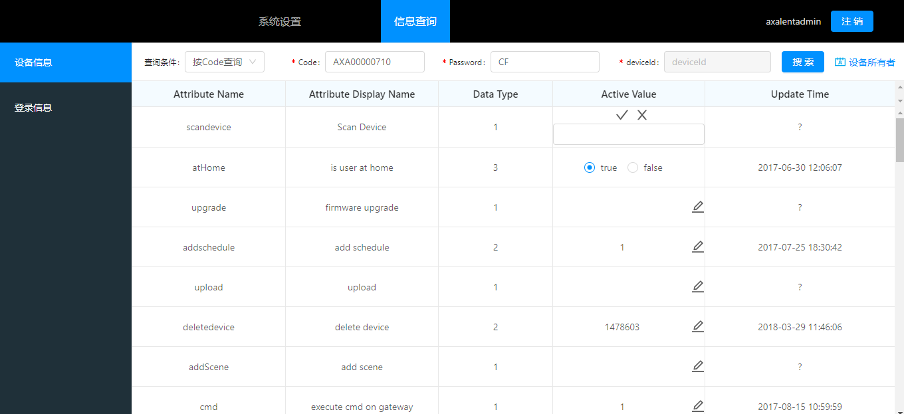

# Configurator 使用手册

## 一、登录

输入正确的管理员账号和密码，点击登录进入首页

## 二、系统配置

### 1. 设备类型

在左侧菜单栏中，选中设备类型时，即可查看所有的设备类型的相关信息（设备类型编号、名称、显示名称）

#### 1.1 添加设备类型

点击右上角添加按钮，会弹出一个带有表单的弹出层，在表单中输入TypeName（类型名称）、DisplayName（类型显示名称），点击确定，即可添加一个设备类型。

#### 1.2 查看属性

点击表格中的一行，即可查询相关设备类型的属性

#### 1.3 添加属性

在查看设备类型的悬浮窗中，在右上角点击添加按钮会出现一个带有表单的弹出层，在表单中输入Name（属性名称）、device(指定是否为硬件属性。硬件属性需要发送到硬件并保存到云端数据库，否则只保存到云端数据库。0=无需发送到硬件（仅存在数据库），1=需要发送到硬件)、ts(是否有历史记录)、tsValueType（数值类型）、displayName（属性显示名称），点击确认即可添加属性

### 2. 用户属性

点击左侧菜单栏中的用户属性，即可查看该管理员下的所有用户属性

#### 2.1 添加用户属性

点击右上角添加按钮会出现一个带有表单弹出层，输入AttributeName(属性名称)、DisplayName(属性显示名称)，点击确定，即可添加用户属性

### 3. Jpush配置

点击左侧菜单栏Jpush配置选型，在右边表单中输入appKey、masterSec，点击确定即可完成Jpush配置

### 4. 短信配置

点击左侧菜单栏的短信配置，在右侧表单中输入accessKey、accessSecret、signName、registerationTemplate、recoverTemplate，点击确定即可完成短信配置

### 5. DeviceCodes

<strong>添加deviceCode</strong>

点击左侧菜单栏中的DeviceCodes，然后点击右上角的添加按钮，会出现一个带有表单的弹出层，输入Code、Password、Aes Key（32位的十六进制的字符串），点击确定，即可注册一个设备

### 6. 用户管理

点击左侧菜单栏中的用户管理，进入用户管理模块

#### 6.1 添加用户

添加右上角添加按钮，会出现一个带有表单的弹出层，输入用户名、密码，点击确定即可在该管理员下添加一个用户

#### 6.2搜索用户

在表格的左上方输入要查询的用户名称，点击搜索，即可查询到用户的相关信息（Disabled为当前用户是否被禁用，0=是，1=否）

 
## 二、信息查询

点击顶部信息查询选项卡即可进入信息查询页面

### 1. 设备信息

当左侧设备信息被激活时，页面右侧可以查询设备信息，以及对设备进行相关的操作

#### 1.1 查看设备信息

在表格上面的表单中，可以根据条件查看相关设备的信息，如果按照Code查询，则输入Code(网关名称)、Password(网关密码)，点击搜索，信息会显示在表格中，如果按照deviceId查询，则输入要查询的deviceId即可

#### 1.2 修改设备属性

设备属性查询出来之后可以对设备属性进行修改，点击表格中Active Value这一列，点击图标，在输入框中输入修改的内容，或点击单选框，即可对设备属性进行设置

#### 1.3 查看设备历史记录

在表格中的Update Time列中，点击时钟图标，会出现一个弹出层，选择开始时间和结束时间，就可以查询到相关设备属性的历史记录

### 2. 登录信息

点击左侧登录信息选项，进入查询登录信息模块

#### 	2.1 查看用户信息

在用户信息表格中输入用户名，点击搜索，就可以查询到最近5条登录信息

