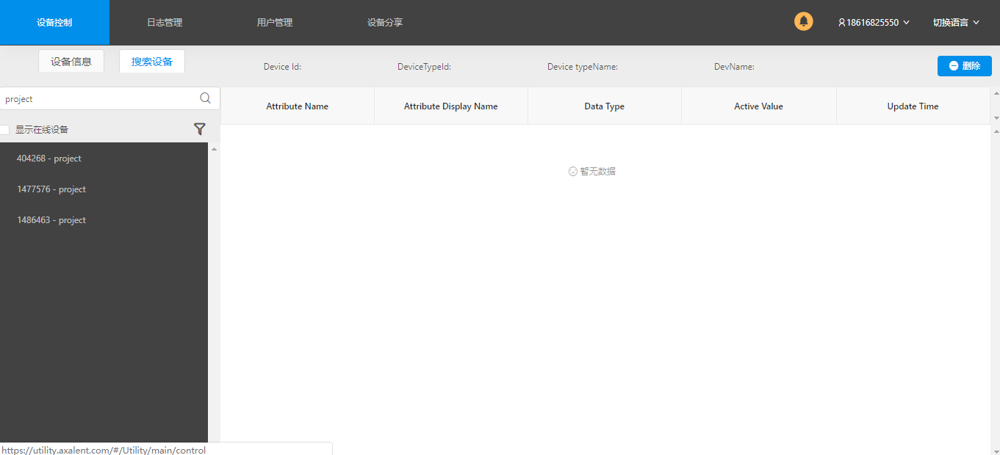
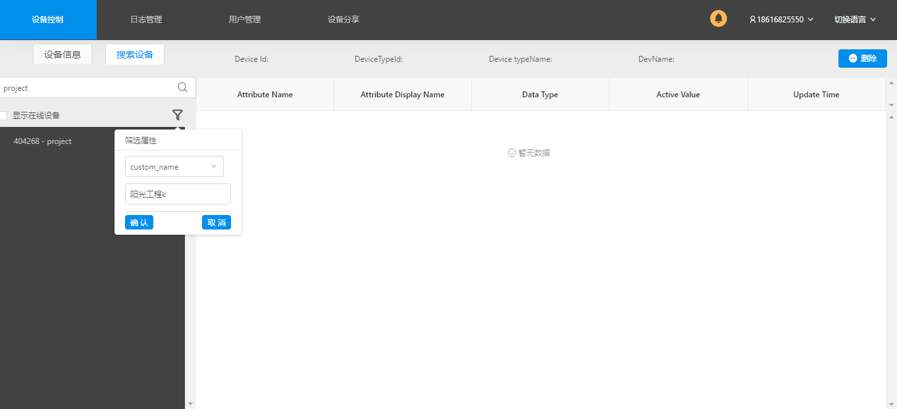
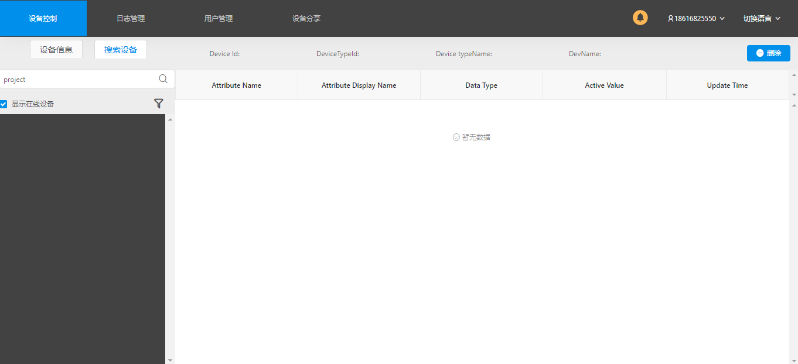
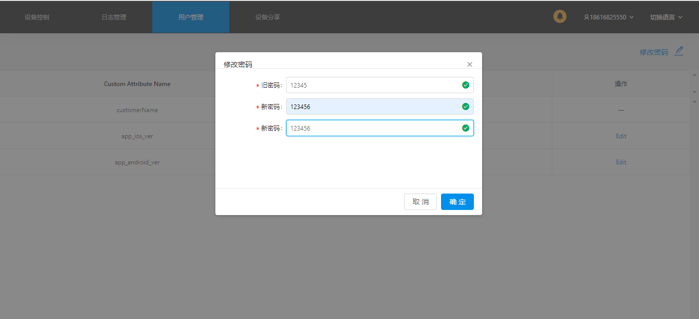
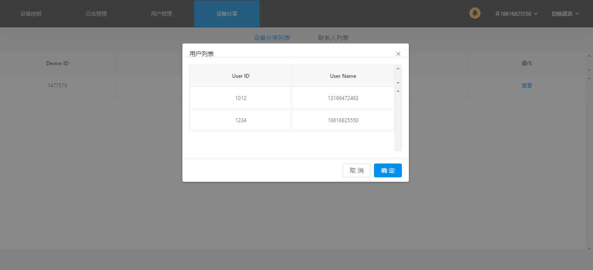
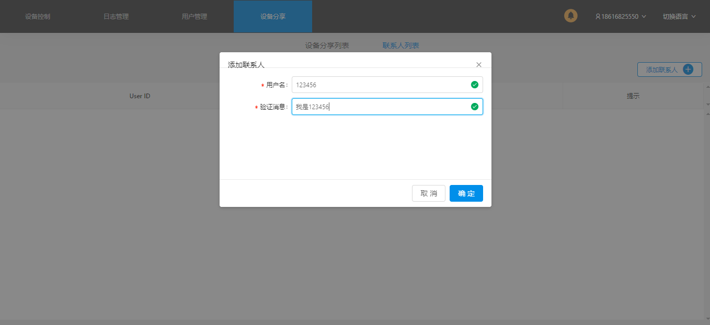

# Utility 管理工具用户手册

## 一、 登录

输入正确的用户名、密码和appID，点击登录进入首页

## 二、设备控制

### 1. 设备信息

#### 1.1 查看设备属性

点击左侧列表查询相关的设备属性以及信息

#### 1.2 修改设备属性

点击右侧表格中的Active Value这一列的铅笔图标，在输入框中输入想要修改的内容，确认修改点击“√”，取消修改点击“×”

#### 1.3 查询设备相关属性的历史记录
在右侧表格Update Time列中，有时钟图标表示可以查询历史记录，否则不能历史记录，
点击时钟，在弹出层中选择开始时间和结束时间，点击搜索，即可查询时间段的历史记录

### 2.添加设备

<strong>添加虚拟设备</strong>

选择左侧设备，点击添加按钮，选择“添加虚拟设备“，在下拉列表中选择设备类型，点击确认，设备会添加到选择的设备下面。如果没有选择设备，则设备会添加到最外层

<strong>绑定设备</strong>

选择左侧设备，点击添加按钮，选择“绑定设备“，在下拉列表中选择设备类型，点击确认，设备会添加到选择的设备下面。如果没有选择设备，则设备会添加到最外层

### 3. 删除设备

在左侧列表选择要删除的设备，点击删除按钮进行删除（网关下的设备不能通过此方式删除）

### 4. 搜索设备

搜索设备：点击搜索设备,进入搜索设备页面，在搜索框中选择设备类型，点击搜索图标开始搜索

搜索设备属性: 搜索完设备之后，点击筛选图标，填写属性名称，属性值，点击按钮进行搜索。

显示在线设备：选择 “显示在线设备”，开始筛选

##  三、日志管理

点击日志管理Tab选项，进入日志管理页面

### 1.查询设备历史记录

选择开始时间和结束时间（开始时间不能大于结束时间），点击搜索即可查询历史记录，点击重置按钮可以重置到初始时间，

### 2.详情页面

#### 2.1设备详情

点击详情可查看相关设备的属性

#### 2.2查看相关设备属性的历史记录

点击时钟图标，可查看相关设备属性的历史记录

## 四、 用户管理

### 1. 修改密码

点击修改密码，在弹出层填写旧密码和新密码，点击确定

### 2. 修改用户属性

点击edit, 输入要修改的内容，最后点击 save

### 五、 设备分享

### 设备分享列表

点击 “查看”，  可查看到被分享设备的相关信息

### 联系人列表

点击添加联系人按钮，在弹出层中填写 用户名和验证消息，点击确定

