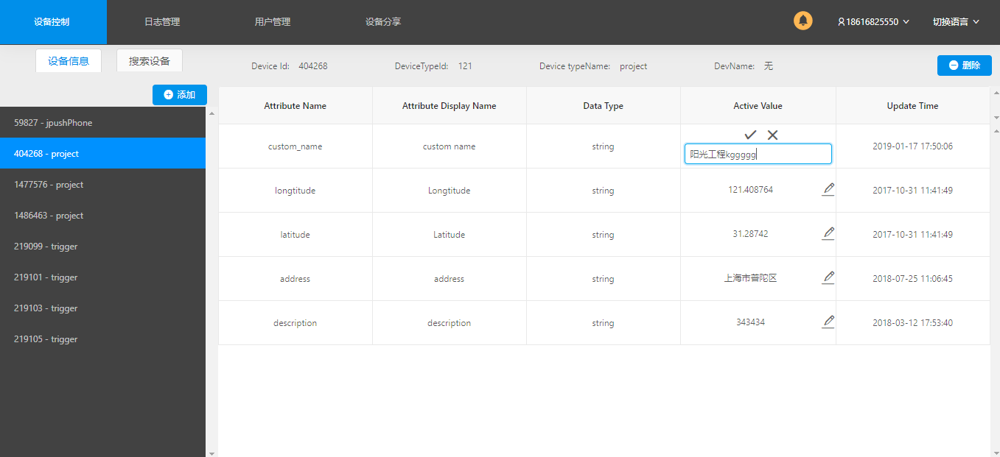
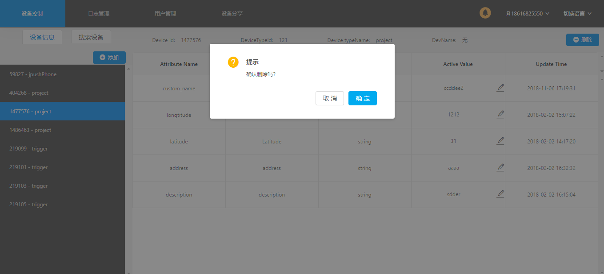
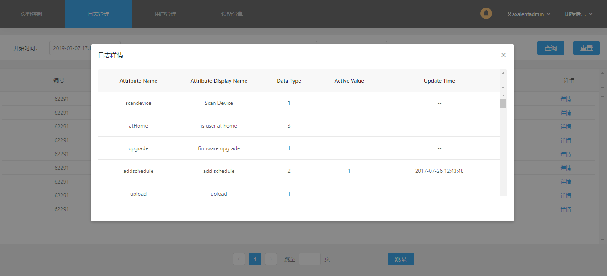

# Utility 管理工具用户手册

## 一、 登录

输入正确的用户名、密码和appID，点击登录进入首页

## 二、设备控制

### 1. 设备信息

#### 1.1 查看设备属性

#### 1.2 修改设备属性

点击右侧表格中的Active Value这一列的铅笔图标，在输入框中输入想要修改的内容，确认修改点击“√”，取消修改点击“×”

#### 1.3 查询设备相关属性的历史记录
在右侧表格Update Time列中，有时钟图标表示可以查询历史记录，否则不能历史记录，
点击时钟，在弹出层中选择开始时间和结束时间，点击搜索，即可查询时间段的历史记录

### 2.添加设备

<strong>添加虚拟设备</strong>

选择左侧设备，点击添加按钮，选择“添加虚拟设备“，在下拉列表中选择设备类型，点击确认，设备会添加到选择的设备下面。如果没有选择设备，则设备会添加到最外层

<strong>绑定设备</strong>

选择左侧设备，点击添加按钮，选择“绑定设备“，在下拉列表中选择设备类型，点击确认，设备会添加到选择的设备下面。如果没有选择设备，则设备会添加到最外层

### 3. 删除设备

在左侧列表选择要删除的设备，点击删除按钮进行删除（网关下的设备不能通过此方式删除）

### 4. 搜索设备

点击搜索设备,进入搜索设备页面，在搜索框中输入要查询的设备，点击搜索图片即可进行搜索。点击搜索之后的结果，即可查询相关设备的属性、设置设备属性以及查看历史记录。
点击带有“显示在线设备”文本的复选框，即可查询全部在线设备

##  三、日志管理

点击日志管理Tab选项，进入日志管理页面

### 1.查询设备历史记录

选择开始时间和结束时间（开始时间不能大于结束时间），点击搜索即可查询历史记录，点击重置按钮可以重置到初始时间，

### 2.详情页面

#### 2.1设备详情

点击详情可查看相关设备的属性

#### 2.2查看相关设备属性的历史记录

点击时钟图标，可查看相关设备属性的历史记录

