# 一、新增地点

打开应用APP，点击”登入”按钮，然后进入地点界面，新增地点，操作步骤如下：

第一步：击左上角的“新增地点”，进入新增地点界面

第二步：输入地点名字，然后点击右上角的保存按钮

第三步：查看刚刚新建的地点是否在地点页正常展示

    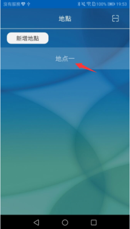

# 二、地点的使用

在地点页选择“地点一”，进入地点界面，下面介绍地点的使用

    

## 2.1 设备的使用 

### 2.1.1新增灯泡

操作步骤：

第一步：点击右下角的设置图标，打开设置界面

第二步：点击灯泡图标，进入灯泡设置界面

第三步：点击新增灯泡，开始搜寻设备

第四步：点击查找到的设备，或者点击“全部匹配”，开始添加设备，并查看添加进度

第五步：查看刚刚添加的设备,点击灯泡设置界面左上角的返回图标，返回到地点页面

第六步:点击全区的开关按钮，点击全区的下拉图标，调节全区的冷暖色，验证灯泡是否可以控制

  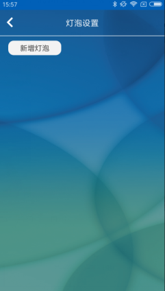      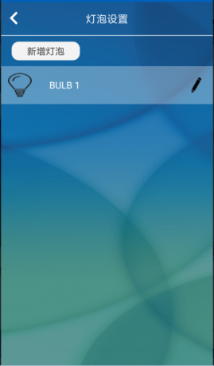  

###  2.1.2 灯泡的修改

操作步骤：

第一步：在地点页面，点击右下角的设置图标，选择灯泡图标，进入灯泡设置界面

第二步：点击灯泡后面的编辑图标，进入灯泡设置界面

第三步：修改灯泡的名字，然后点击保存按钮

第四步：查看设备是否修改成功

   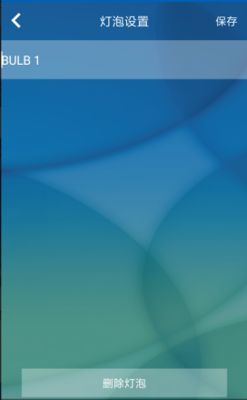 

###  2.1.3 灯泡的删除

当灯泡不再使用时，可以删除灯泡，操作步骤如下：

操作步骤：

第一步：在地点页面，点击右下角的设置图标，选择灯泡图标，进入灯泡设置界面

第二步：点击灯泡后面的编辑图标，进入灯泡设置界面

第三步：点击删除灯泡按钮

第四步：查看设备是否删除成功

   

##  2.2房间的使用

当设备下面添加有设备时，可以通过房间控制设备的开关和场景，操作步骤如下：

第一步：控制房间的开关和冷暖色，查看设备是否反应正常

第二步：点击房间一，进入房间下的场景界面

第三步：控制默认的四个场景，看设备是否有反应

第四步：进入灯泡，进入房间下的灯泡控制界面，控制灯泡的开关，查看灯泡是否反应正常
备注：全区的使用和房间的使用模式一样，当控制全区时，房间的状态跟着改变

       

### 2.2.1 新增房间

操作步骤：

第一步：打开右下角的设置图标，点击“房子图标”，进入房间设置界面

第二步：点击新增房间按钮，进入新房间界面

第三步：输入房间名字，选择房间类型，选择灯泡，然后点击右上角的保存按钮

第四步：查看刚刚创建的房间，并点击房间设置界面左上角的返回按钮，返回到地点页面

第五步：控制房间一的开关，打开房间下的下拉图标，调节房间的冷暖色，查看灯是否有反应

 
 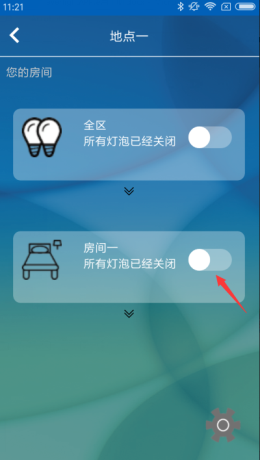
 
 
### 2.2.2 房间的修改

操作步骤：

步骤一：在地点页，点击右下角的设置图标，选择房间图标，进入房间设置界面

步骤二：点击房间后的编辑图标，进入房间设置界面

步骤三：修改房间 名、位置、选择灯泡，然后点击右上角的保存按钮

步骤四：查看是否修改成功

       

### 2.2.3 房间的删除

操作步骤：

步骤一：在地点页，点击右下角的设置图标，选择房间图标，进入房间设置界面

步骤二：点击房间后的编辑图标，进入房间设置界面

步骤三：点击删除房间按钮，然后查看房间是否被成功删除

   

## 2.3场景的使用

### 2.3.1 新增场景

在全区或者房间下，可以使用场景，具体步骤如下：

操作 步骤：

第一步：在地点页面，点击房间一（或者全区图标），进入房间设置界面

第二步：默认有四个场景，可以直接使用该场景，不可编辑和删除；或者点击新增场景
图标，进入到新增场景界面

第三步：输入场景名、设置场景，然后点击右上角的保存按钮

第四步：查看刚刚创建的场景，并点击该场景，查看灯是否响应正确

### 2.3.2 场景的修改

操作步骤：

第一步：进入到房间界面，点击场景后面的编辑图标，进入到场景界面

第二步：修改场景名字或者想设置的场景

第三步：点击右上角的保存按钮

第四步：控制修改后的场景，查看是否修改成功

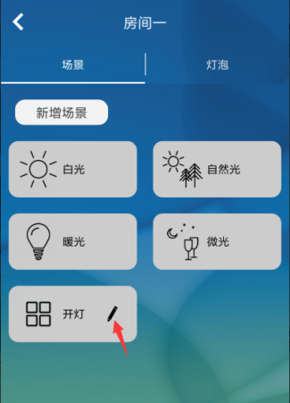

### 2.3.3 场景的删除

操作步骤：

第一步：进入到房间界面，点击场景后面的编辑图标，进入到场景界面

第二步：点击下面的“删除场景“按钮

第三步：查看场景是否删除成功

备注：只有新增的场景才可以修改和删除，默认的四个场景：白光、自然光、暖光、微光，不可以修改和删除

## 2.4 日程的使用

新增场景之后，才可以使用日程，日程的创建如下：

操作步骤：

第一步：在地点页，点击左下角的设置图标，选择时钟图标，进入地点咨询页面

第二步：点击“新增时程”按钮，进入新增时程界面

第三步：输入时程名字、选择房间下新增的场景、时间、重复方式（如不选择重复方式，此时时程只执行一次），然后点击右上角的保存按钮

第四步：查看时程是否创建成功，并验证在该时刻，时程是否正确执行（如果去掉时程后面的勾选按钮或者禁用时程，该时程将不会执行） 

 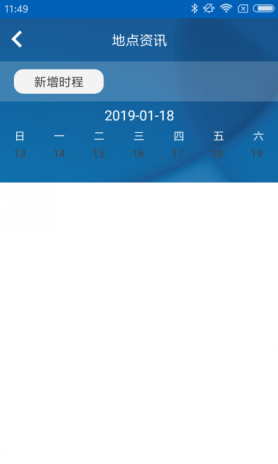 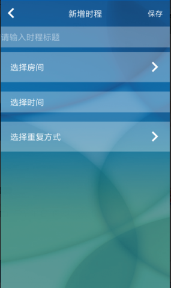 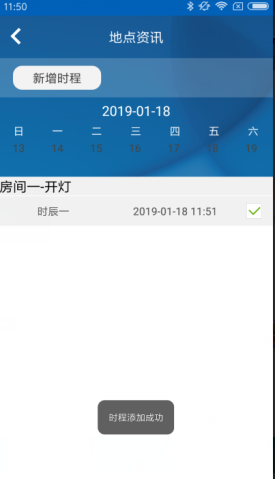 

### 2.4.2 时程的修改

操作步骤：

第一步：在地点咨询页面，点击时程一，进入时程界面

第二步：修改时程的名字、相应场景、时间或者重复方式

第三步：点击右上角的保存按钮

第四步：查看时程是否修改成功，并在修改后的时间点执行（如果去掉时程后面的勾选按钮或者禁用时程，该时程将不会执行）

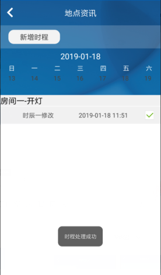

### 2.4.3 时程的删除

操作步骤：

第一步：在地点咨询页面，点击时程一，进入时程界面

第二步：点击下侧的“删除时程”按钮

第三步：时程时程是否成功删除  

  

## 2.5地点咨询

进入地点页面，点击右下角的设置图标，选择i图标进入地点资讯页面

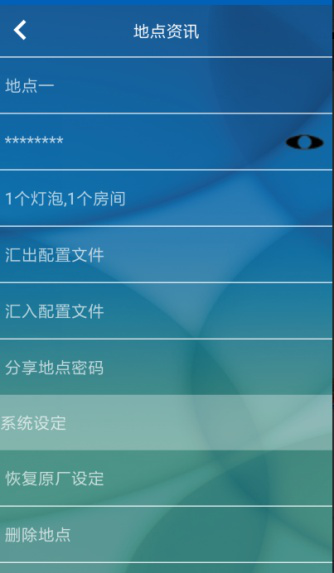

### 2.5.1 地点名的修改

操作步骤：

第一步：进入地点资讯页面，点击地点名，进入更改地点名字页面

第二步：修改地点名字，然后点击右上角的保存按钮

第三步：查看地点名字是否修改成功

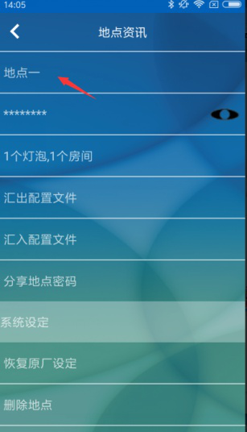

###  2.5.2 地点密码的查看

操作步骤：

第一步：进入地点资讯页面

第二：长按或者点击密码栏后的图标，查看地点密码

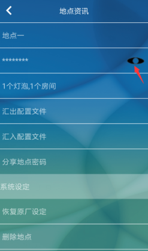

###  2.5.3 查看地点资讯

操作步骤：

第一步：进入地点资讯页面

第二步：查看地点下的设备、房间、场景、时程信息

### 2.5.4 汇出详细设定资料

操作步骤：

第一步：进入地点资讯页面

第二步：点击“汇出详细设定资料“，然后选择汇出方式

第三步：根据汇出方式发送或者保存

### 2.5.5汇入详细设定资料

操作步骤：

第一步：进入地点资讯页面

第二步：点击“汇入详细设定资料“，找到数据文件然后导入

第三步：在弹出的提示信息中点击“是“

第四步：查看导入的数据是否成功导入

### 2.5.6 分享地点密码

操作步骤：

第一步：手机A进入地点页，点击分享地点密码，成功打开该地点二维码

第二步：手机B在地点首页，点击右上角的扫描按钮

第三步：手机B扫描手机A地点二维码信息，输入地点名并保存

第四步：手机B进入刚刚创建的地点，控制全区，查看设备是否有反应

### 2.5.7 恢复原厂设定

操作步骤：

第一步：进入地点咨询页面

第二步：点击恢复原厂设定，进入恢复原厂设定界面

第三步：点击“恢复原厂设定“按钮，在弹出的提示信息中点击确认

第四步：查看是否重置成功；如果失败，请检查设备是否上电，并再次尝试

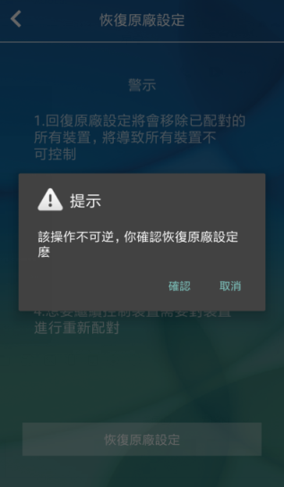

### 2.5.8 删除地点

恢复原厂设定之后，就可以删除地点，具体操作如下

操作步骤：

第一步：进入地点咨询页面

第二步：点击删除地点按钮

第三步：在弹出的提示信息中选择“确认“按钮（如果需要输入地点密码则输入地点密码）

第四步：查看地点是否成功删除

### 2.5.9 关于

操作步骤：

第一步：进入地点资讯页面

第二步：点击关于按钮，进入关于界面

第三步：查看信息是否展示正确

