# xCloud功能概述说明

## 1.概况

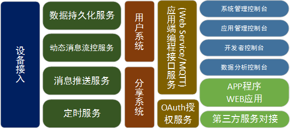

###  1)设备端
<strong>面向设备设计：</strong>实体设备（空调、洗衣机等），虚拟设备（区域、场景、组等），服务设备（消息流服务设备，定时服务设备， 消息推送服务设备）

<strong>设备接入：</strong>提供稳定高效的设备接入服务用于接入空调、洗衣机等实体设备

<strong>设备关联互动：</strong>设备和设备间的消息互动，设备与服务设备之间的互动（定时服务设备， 推送服务设备）， 服务设备与服务设备间互动（定时设备，推送设备，消息流设备）

###  2)用户管理端

<strong>多应用支持：</strong>支持不相关产品和项目应用，每个应用有独立的云平台资源空间。应用有唯一APPID，每个应用有独立的管理员账户，负责管理和维护应用的相关配置，包括：推送配置、设备类型配置、短信配置等。

<strong>层级用户体系： </strong>管理员进行项目管理，负责产品创建和维护。 普通用户可以绑定和使用产品。普通用户可以创建、禁用子用户。

<strong>普通用户注册方式：</strong>
管理员创建普通用户： 通过用户名、密码方式创建普通用户。
手机注册普通用户： 普通用户通过短信验证码方式注册普通用户账号。

<strong>分享系统：</strong>
Owner: 设备的所有者， 享有对设备的所有权限。

<strong>分享：</strong>设备Owner可以将设备分享给其他用户， 分享时可以指定被分享用户对设备有（完全控制， 可读写， 只读， 只写）

###  3)管理工具端

<strong>系统管理控制台：</strong>后台运维相关工作
<strong>应用管理控制台：</strong>用于项目的维护和管理工作
<strong>开发者控制台：</strong> 用于项目开发人员开发和调试
<strong>数据分析控制台：</strong> 用于项目后期数据监控

##  2.  面向设备的平台

设备由唯一的设备类型和一组设备属性构成。 设备属性代表设备的状态。 通过改变设备属性达到改变设备状态的目的。

<strong>实体设备：</strong> 空调、洗衣机等实体设备， 在生产的时候， 每个实体设备会内置唯一的DEVICE CODE

<strong>虚拟设备：</strong>区域、建筑、场景、组等应用中存在的物体， 但是没有实体设备跟后台连接

<strong>服务设备：</strong>服务设备是特殊的虚拟设备， 有消息流服务设备、定时服务设备、消息推送服务设备等， 这些设备有后台服务与之相对应。服务设备是云平台内置的虚拟设备类型。

<strong>自定义设备类型：</strong>开发者可以通过平台管理工具创建自定义设备，并定义相关的属性。

<strong>设备属性流：</strong> 设备状态改变的时候会产生设备属性流。平台提供设备属性流服务来重定向属性流，达到设备互动的目的。互动可以在设备与设备，设备与服务，以及服务与

###  2.1 服务设备

服务间完成。提供更加动态化的服务流控规则。

#### 2.1.1  消息流控服务设备 - trigger

|属性名称|属性描述|
|----|----|
srcId|源设备的设备ID, 账户下有读权限的设备以上|
srcAttribute|源设备的设备属性名称|
value|源设备的设备属性设定值|
operator|判断条件，共7种值(1:小于，2：小于等于，3：等于，4：大于等于，5：大于，6：字符串相同，7：正则表达式成立)|
targetId|目标设备的设备ID，账户下有写权限以上的设备|
targetTypeId|目标设备的设备类型ID|
targetAttribute|目标设备的设备属性名称|
targetValue|目标设备的设备属性设定值|
enabled|此trigger是否启用|

<strong>创建：</strong> createVirtualDevice接口创建trigger类型设备。 

<strong>修改： </strong>setDeviceAttribute接口修改trigger规则

<strong>删除： </strong>removeDeviceFromUser接口删除trigger规则
说明： 设备属性流控，检测账户下指定设备的消息流， 并产生给另一指定设备的消息流。

<strong>应用场景1：</strong> 
过道有人经过的时候， 打开灯：
当人体感应A属性motion 为True时, 设定灯 B的属性level为100

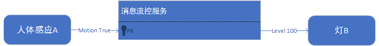

在这个应用场景中有三个设备实例：

<strong>人体感应器：</strong>

|属性|值|
|----|----|
ID|12345|
typeID|10001|
Name|人体感应器|
Motion|false|

<strong>灯：</strong>

|属性|值|
|----|----|
ID|12346|
typeID|10002|
Name|走廊灯|
Level|0|
Power|Off|

<strong>Trigger：</strong>

|属性名称|属性描述|
|----|----|
srcId|12345（人体感应设备ID）
srcAttribute|Motion（人体感应检测设备）|
value|True（True：检测到人）
operator|==（源属性相等，检测到人时触发）|
targetId|12346(灯设备)|
targetTypeId|灯设备类型ID|
targetAttribute|Level(监测到人时，进行调光动作)|
targetValue|80（调亮灯光）|
enabled|True(此规则处于工作状态)

<strong>应用场景2：</strong>

离开房间的时候，通过手机点击离家场景， 关闭所有的电器：
当场景-离家属性activate为True时， 设定light A的属性level为0
设定电视机 B 的属性power为False
设定空调 C 的属性power为False

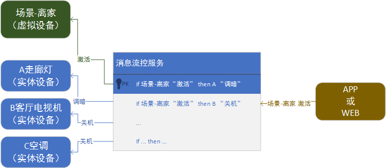

###  2.1.2	定时服务设备 - schedule

 
|属性名称|属性描述|
|----|----|
activate|当此schedule设定的时间到了后，此条属性会被设置为1|
cycle|设置定时循环，Never(不循环，第一次定时时间完成后，enable属性自动设置为0)，Day，Week，Month，Year|
datetime|定时时间点，标准时间|
userData|存储用户数据|
custom_name|存储schedule名称|
enable|schedule是否启用|

创建、修改、删除参考trigger设备

说明： 创建日程设备， 在指定的时间和周期内触发activate属性为True。

示例： 办公室进入午休时间，调暗灯光， 空调风量调小

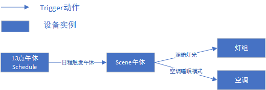

###	2.1.3	极光消息推送 - JPushNotification

|属性名称|属性描述|
|----|----|
phoneId|手机唯一识别码|
platform|IOS或And|
alias|推送组别名|
msg|推送的消息|
apns_production|IOS推送服务器标志|

创建、修改、删除参考trigger设备
说明： 用于手机消息推送

###	2.1.4微信消息推送 - WXPushNotification

|属性名称|属性描述|
|----|----|
touser|微信用户唯一标志|
template|微信消息推送模板|
form_id|微信推送授权标志|
keywords|微信推送的消息|
send|发送消息|

创建、修改、删除参考trigger设备
说明： 用于微信小程序模板消息推送

<strong>更复杂的联动：</strong>

<strong>场景1：</strong> 当检测到家里人的手机回到家的时候， 把安防系统设定为在家的模式。

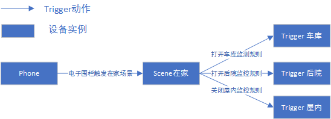

<strong>场景2：</strong> 在休息日时， 将公司的安防系统自动上防

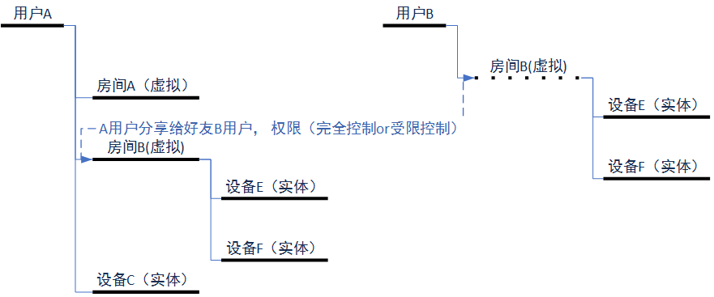

这些更为复杂的应用都可以通过设备、schedule以及trigger的组合来完成。

##	3.  用户系统

用户注册方式：

1.管理员createUser 创建普通用户， 普通用户和管理员之间互为好友状态。

2.普通用户通过手机验证码注册账户。

### 3.1 分享系统

普通用户间、普通用户和子用户间、以及子用户间可以相互添加成为联系人。

1）联系人之间可以进行设备分享。 
2）设备的Owner有权限分享设备给其他联系人。
3）被分享设备的联系人可以享有设备的（完全控制， 读写，只读， 只写）权限

应用场景： 在家庭中， 爸爸和妈妈有自己独立的账户， 爸爸负责安装客厅里面的设备。这个时候爸爸可以把客厅的权限分享给妈妈。

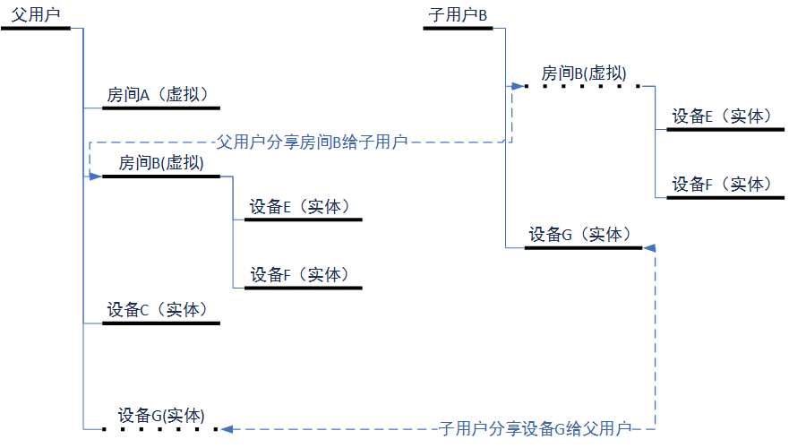

各种权限说明：

完全控制： 
1）控制和查询设备状态
2）在设备下添加和删除子设备
3）再次分享设备

读写： 
1)可以控制和查询设备状态

只读：
1)可以查询设备状态

只写：
1)可以控制设备状态

###  3.2  分级用户系统

普通用户可以创建子用户。

1)通过用户名和密码方式创建子用户。子用户是特殊的普通用户， 享有部分普通用户权限（添加、删除设备、好友管理等）。
2)父用户和子用户互为联系人关系， 可以相互分享设备。
3)子用户无法创建下级子用户。
4)父用户可以对子用户进行密码修改以及账户启用和禁用的操作。

除了上述描述外，子用户享有和普通用户一样， 可以添加和删除自己采购的设备。

<strong>应用场景1：</strong>在家庭中，爸爸拥有自己的账户，爸爸创建子账户给小朋友使用。爸爸负责安装了客厅里面的设备。爸爸分享客厅的使用权限给小朋友。 小朋友在自己的房间安装了一个智能灯，小朋友分享智能灯的权限给爸爸。

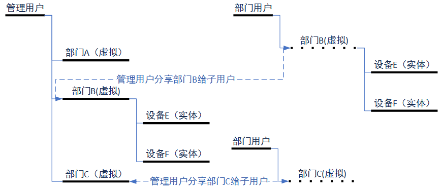

<strong>应用场景2：</strong>在楼宇照明中，管理员拥有自己的账户，管理员创建了子账户给企业里面的各个部门使用。管理员负责整栋楼宇的设备安装和规则配置。管理员分享各个部门给部门账户使用。

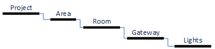

## 4. 树形设备系统

树形设备系统： 虚拟设备下面可以再次创建虚拟设备或者挂载实体设备。对应在实际应用中， 有区域、建筑、楼层、房间的场景需求。
createVirtualDevice创建虚拟设备时指定父设备ID，可以达到创建子虚拟设备的目的。

<strong>应用场景：</strong>在楼宇照明系统中， 存在项目、楼层、房间、网关、灯等层级结构。

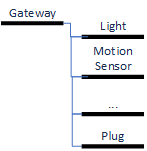

上述虚拟设备类型：项目、楼层、房间等， 是由项目需求决定。 开发者通过Configurator管理工具来创建这些设备类型并定义属性列表， 之后通过createVirtualDevice来创建虚拟设备实例（Project、Area、Room）。创建子设备实例的时候，指定parentId系统将会将子设备实例挂载到指定父设备实例下。

<strong>网关设备系统</strong>

网关设备可以创建和维护子设备， 子设备拥有自己的设备ID和设备类型，只是借用网关设备的通道与服务器进行通信。在设备列表中，为网关设备的下一级子设备。详见：网关设备接入说明书

<strong>应用场景：</strong>蓝牙Mesh网关下面需要兼容灯具、人体感应、智能开关等设备。

这个应用场景的限制条件：这个应用场景的限制条件：

1）每种类型子设备的数量不确定
2）子设备的设备ID由蓝牙Mesh网络决定，服务器端事先无法知道设备ID

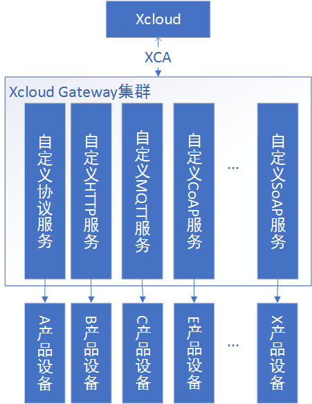

产品定义确定后，通过Configurator管理工具创建Gateway、Light、Motion、Plug等设备类型并定义属性列表。

<strong>嵌入式端：</strong>

网关在设备SDK通过生产时内置的CODE、PW和AES Key登陆服务器端。当网关配对新的子设备的时候，调用AxLogin接口传入本地蓝牙网络ID以及设备类型（Light、Motion Sensor或Plug）获得session。之后通过session与服务器进行通信。需要登出子设备可以调用AxLogout接口， 当设备移除的时候调用AxDelete接口。

<strong>APP端：</strong>通过getDeviceList会获取的账户下面树形列表的设备列表。Gateway创建的子设备挂载在gateway设备下面。除了子设备由网关添加和删除外， APP端操作子设备和其他设备无差别。

##  5. API/SDK 支持

<strong>嵌入式端：</strong>

1）双芯片方案，采用协议集成的Wi-Fi模块。现有的已经集成XCA协议的Wi-Fi模块有庆科、汉风、QCA4004以及乐鑫等。客户应用主MCU通过串口协议与Wi-Fi模块通信。
2）单芯片方案，集成XCA SDK到主芯片中， 平台需求：RAM 10k, 支持TCP/UDP.
3）网关方案，集成XGM SDK， 通过XGM SDK与服务端通信。操作系统需求：Linux.
4）多协议扩展（规划中）： 提供服务端Adaptor服务器兼容其他协议接入设备。

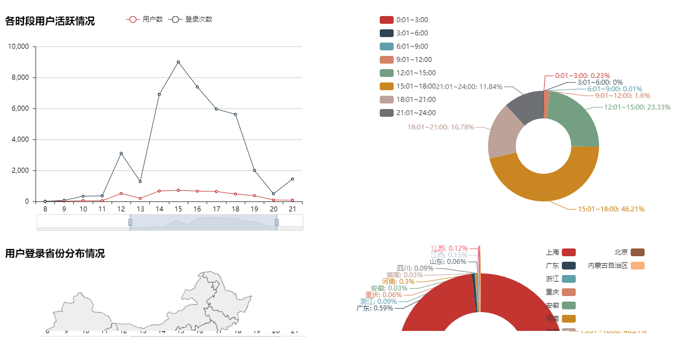

<strong>APP端：</strong>

1）公版My Home APP， 遵循平台定义设备类型的嵌入式设备，可以直接使用My Home APP控制和使用。
2）Web service API用于开发APP端应用。
3）Android/iOS/React Native/JS SDK，封装Web Service API，提供友好编程接口，加快APP开发速度。
4）提供控制台自动生成指定设备类型的Demo APP代码（Android/iOS），用户在此基础上修改，替换产品UI.（规划中）

##  6. 数据分析  

提供数据分析控制台工具， 用于在项目运维中对产品和项目数据分析，目前控制台已经内置：

用户分析： 用户数量、用户日活、用户登陆地点分布

设备分析： 设备数量、设备激活数量、设备日活等

自定义分析： 在控制台内， 可以自定义Python脚本在Python SDK的基础上进行数据获取，数据分析以及报表展示等工作。

